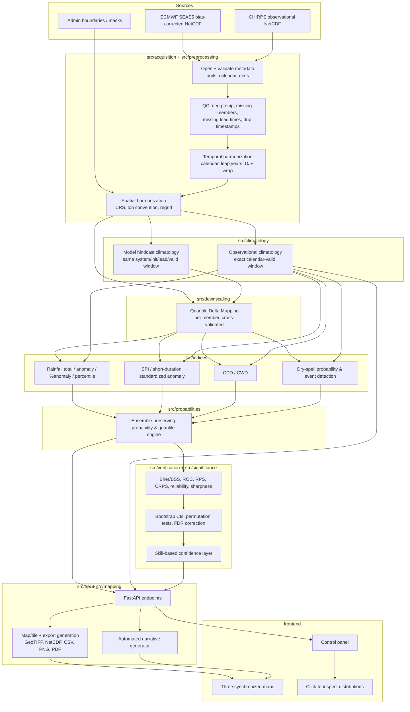

# Extremes Forecasting Tool — Architecture & Methodology

## 1. Concise interpretation of requirements

Build a configurable, region-agnostic system that turns ensemble precipitation forecasts
(sub-seasonal and seasonal) into probabilistic drought/extreme indices, compares them
against observational climatology for the *exact same calendar window*, verifies forecast
skill against hindcasts, and serves the result through an API + three-map dashboard. Ethiopia
is the first deployment, not a hard-coded target. Ensemble structure must be preserved end to
end — no collapsing to the mean before computing probabilities.

## 2. What is actually on disk (inspected, not assumed)

Per the instruction not to fabricate metadata, I opened the three files you provided instead
of guessing SEAS5 conventions:

| File | Dims | Var | Units | Coverage |
|---|---|---|---|---|
| `data/bias-corrected/corrected_1993_2025.nc` | lat(48) × lon(60) × time(6039) × realization(51) | `pr` | `mm/day` (GRIB source `tp`, metres) | **1 May – 31 Oct only, every year 1993–2025** (183 days × 33 yrs) |
| `data/bias-corrected/corrected_2026.nc` | lat(48) × lon(60) × time(183) × realization(25) | `pr` | `mm/day` | 2 May – 31 Oct 2026 |
| `data/chrips_historical/et_chirps_pr_r25_1993_2025.nc` | time(12053) × lat(48) × lon(60) | `precip` | `mm/day` | full daily record, 1993–2025 |

Grid: 0.25° over `lat 3.125–14.875`, `lon 33.125–47.875` — Ethiopia + margin. This matches CHIRPS `r25`.

**Findings that change the spec's defaults — flagged rather than silently "fixed":**

1. **No explicit init-date/lead-time dimension.** Only `time` (valid date) and `realization`
   exist. Every year in the hindcast file runs exactly 1/2 May → 31 Oct, so this is a
   **single annual initialization cycle** (~late April/1 May), not a multi-month init
   calendar. Lead time must be *derived* as `valid_date − season_start(year)`, and the
   config's "forecast initialization date" control is effectively "which year," not an
   arbitrary date, for this dataset. The pipeline stays generic (it accepts an
   `init_date` parameter), but the Ethiopia config's default `valid_init_frequency` is
   `annual, ~May 1`, not monthly.
2. **Ensemble size changes with year, and it's a real QC case, not a bug I'm patching
   around.** Years 1993–2016 populate realizations 0–24 only; realizations 25–50 are
   NaN for those years. Years 2017–2025 populate all 51. This is the known SEAS5
   history (25-member hindcast → 51-member operational from 2017), preserved as NaN
   padding after concatenation. **The QC module must detect per-year available-member
   count and the indices/probability code must drop NaN members rather than assume a
   fixed N=51** — this is exactly the "missing ensemble members" check from §6.5, and I
   verified it fires correctly against real data rather than a synthetic case.
3. **2026 forecast has 25 members**, not 51. Config-driven, not hard-coded — the
   pipeline must read `realization.size` at load time everywhere (no `N_ENS=51` constant
   anywhere in code).
4. **Hindcast boundary is 1993–2016, not 1993–2017** as stated in your brief (§3.1). I'm
   using what's in the file (2017 is fully populated → operational) rather than the
   brief's number.
5. Units are already CF `mm/day` on all three files (the `pr` GRIB metadata also carries
   `GRIB_units: m`, i.e. the pre-conversion unit — harmless leftover, but the unit
   handler must read `.attrs["units"]`, not assume, and must not double-convert).
6. Domain here only covers MJJASO. Config remains season-agnostic (DJF etc. supported
   generically for future regions/datasets), but the Ethiopia demo config's seasons are
   populated from what's actually verifiable against this data: JJAS (peak kiremt) and a
   MAM slice are hindcast-verifiable; OND/DJF are **not** verifiable against this dataset
   (no Nov–Apr data) and must be marked as such in config rather than silently offered.

None of this blocks the architecture — it's exactly why every boundary/threshold/period is
config-driven — but it does change what the *Ethiopia default config* should say, and it
means the QC and verification modules have real, present-day test fixtures instead of only
synthetic ones.

## 3. Scientific assumptions and decisions (defaults chosen where the spec leaves it open)

| Decision point | Default chosen | Rationale | Configurable? |
|---|---|---|---|
| SPI fitting | Gamma (2-parameter, MLE) with empirical fallback when <20 non-zero years or Anderson-Darling GoF fails | Standard WMO SPI practice; empirical fallback avoids unstable tails in dry regions | Yes — `spi.fit_method` |
| SPI zero-handling | Mixed distribution: `P(X=0) = q`, gamma fit on `X>0`, per McKee et al. 1993 | Handles frequent zero-precip windows in short accumulations | Yes |
| Short-duration standardized index | Labeled "Standardized 7-day / 14-day Precipitation Anomaly," **never** "SPI-7day" | Per your explicit instruction in §9.5 not to misrepresent temporal scale | Label text is config |
| Dry-spell boundary handling | Default = "seamless observation→forecast series" (uses last N observed days as spell context at forecast start) | Gives more realistic spell probabilities at the start of the window than "strict window" | 3 modes selectable per §9.7 |
| Bias correction | Member-wise Quantile Delta Mapping (QDM), fit on hindcast years, leave-one-year-out cross-validated | Preserves ensemble spread better than mean-only scaling; avoids inflating skill via in-sample fitting | Yes — pluggable `bias_correction.method` |
| Regridding | Conservative (area-weighted, via xESMF) for precipitation totals; bilinear offered as alternative for diagnostics only | Conservative regridding preserves volume, correct for accumulated rainfall | Yes |
| Significance (departure) | Nonparametric: forecast-ensemble-vs-climatology percentile + BCa bootstrap CI on the anomaly, ensemble members resampled as a *cluster* (one draw per hindcast year, not per member) | Avoids the explicit anti-pattern in §13.1 (members ≠ independent samples) | Yes |
| Significance (skill) | Block bootstrap over hindcast **years** (not days, not members) for BSS/ROC-AUC/correlation CIs | Preserves inter-annual independence, respects temporal dependence within a season | Yes |
| Multiple testing | Benjamini–Hochberg FDR, α=0.05 default | Standard, less conservative than Bonferroni for spatial fields | Yes |
| Minimum climatological denominator (% anomaly) | 1.0 mm over the accumulation window (configurable) | Prevents divide-by-near-zero blowups in dry cells | Yes |
| Percentile categories | WMO/IRI 7-category scheme (§9.4) | Matches your spec verbatim | Thresholds configurable |

## 4. System architecture



## 5. Index definitions & equations

Let member `m ∈ {1..N(t)}` (N depends on year, see finding #2), valid window `W` = the exact
calendar days requested (e.g. 8–14 Aug), `R_m,y(W)` = accumulated precip for member `m` /
hindcast year `y` over window `W`.

- **Rainfall total**: `T_m = Σ_{d∈W} pr_m,d`. Ensemble stats (mean/median/sd/IQR/quantiles/
  min/max) computed across `m`, never collapsing first.
- **Absolute anomaly**: `A_m = T_m − Clim(W)` where `Clim(W)` = mean (or median, configurable)
  of the *observational* or *hindcast* climatology for the identical `W` across the
  climatology years — **computed per member before ensemble aggregation** (§9.2).
- **Percent anomaly**: `P_m = 100 · A_m / max(Clim(W), τ_min)`, masked where `Clim(W) < τ_min`
  (default `τ_min = 1 mm`), and the mask is carried in output metadata, not silently dropped.
- **Percentile**: rank of `T_m` within `{R_·,y(W): y ∈ climatology years}` via
  Weibull plotting position `i/(n+1)`.
- **SPI(k)**: fit gamma (or empirical fallback) to `{R_·,y(W_k)}` for accumulation `k` from the
  matching climatology (observational for calibration; hindcast for model-space anomalies),
  transform via equiprobability to `N(0,1)`. `k` ∈ {7d, 14d (labeled as standardized anomaly),
  1,2,3,4,5,6 month}.
- **No-rain threshold `τ`**: dry day `pr_d < τ`, wet day `pr_d ≥ τ`, user-configurable
  (0.1/0.5/1.0/2.0 mm or custom), always echoed in output metadata.
- **CDD / CWD**: max run-length of `pr_d < τ` / `pr_d ≥ τ` within the (possibly extended, per
  boundary-handling mode) window, computed per member.
- **Dry-spell event**: qualifying if run-length ≥ user threshold (5/7/9/custom); record
  start/end/duration/count per member, then aggregate to probability across members.
- **Brier Score**: `BS = (1/n) Σ (p_i − o_i)²`; **BSS** `= 1 − BS/BS_ref`.
- **CRPS**, **RPS**, ROC/AUC, reliability/sharpness/rank histogram: via `xskillscore` /
  `properscoring`, computed against the full ensemble CDF, not the mean.

## 6. Processing workflow (operational cycle)

1. Ingest new forecast file (or fetch from CDS/MARS when live access is configured) →
   validate metadata → QC report (fail/warn/pass per §6.5 checks).
2. Harmonize calendar + grid against the target config grid; regrid CHIRPS and forecast to
   the same target grid if they differ.
3. Compute/refresh observational climatology (cached per calendar window) and hindcast
   climatology (cached per system/init/lead/valid window) — both versioned, not recomputed
   per request.
4. Bias-correct the live forecast member-wise using the fitted QDM parameters from the
   hindcast (cross-validated fit reused, not refit against the live year).
5. Compute requested indices per member, at full ensemble resolution.
6. Compute probabilistic products (exceedance, category, quantiles) across members.
7. Attach skill/confidence layer from the verification store (precomputed against hindcasts,
   not recomputed live).
8. Render three-map product + narrative + exports; write processing manifest (inputs, config
   hash, software version, timestamps) alongside every output.

## 7. Repository structure

Created on disk under `d:\extremes-climate-indices\`:

```
configs/{regions,models,indices,climatology,verification}/
data/{raw,interim,processed,climatology,hindcasts,forecasts,boundaries,
      bias-corrected,chrips_historical}/   <- last two are your existing inputs
src/{acquisition,preprocessing,downscaling,climatology,indices,
     probabilities,verification,significance,mapping,api,workflows,utilities}/
frontend/
notebooks/
tests/{unit,integration,scientific_validation}/
outputs/{maps,netcdf,geotiff,csv,reports,verification}/
docs/
```

## 8. Implementation roadmap (scope-gated — see note below)

- **Phase 1 — done:** config schema; NetCDF loaders + metadata validation + QC for all three
  real files; temporal/spatial harmonization incl. polygon boundary clipping to the real
  admin0-3 shapefiles; observational climatology for exact calendar windows (sub-seasonal
  week1-week3_4 and seasonal JJAS/MJJASO/June-September); rainfall total/anomaly/%anomaly/
  percentile; CDD/CWD; 5/7/9-day dry-spell probability; SPI / standardized short-duration
  anomaly (pulled forward from the original Phase 3 scope — see
  [methodology.md §4](methodology.md#4-standardized-precipitation-index--standardized-short-duration-anomaly));
  synchronized three-panel maps; NetCDF/GeoTIFF/CSV export with full provenance metadata incl.
  bias-correction provenance; single-period and full-batch CLI workflows; 61 unit +
  scientific-validation + integration tests. Full method-by-method writeup in
  [methodology.md](methodology.md); pipeline/CLI/bug log in [operations.md](operations.md).
- **Phase 2 (not started):** hindcast-based bias correction/QDM module. Not currently needed —
  the on-disk hindcast and 2026 forecast already arrive QDM-corrected upstream — but the module
  remains valuable for any future dataset that isn't pre-corrected, or for evaluating the
  upstream correction's own skill.
- **Phase 4 — done:** leakage-free hindcast verification (leave-one-year-out percentile/SPI/
  tercile thresholds, fixed 25-member ensemble across the full 1993-2025 record); Brier Score/
  BSS, reliability/sharpness/discrimination diagrams, ROC/AUC, RPS/RPSS, CRPS/CRPSS, rank
  histogram, deterministic metrics (bias/MAE/RMSE/correlation/ACC), contingency metrics (ETS/
  POD/FAR/frequency bias), spread-error relationship — run against the real hindcast set (33
  years) for all 7 configured events across 3 periods, producing scientifically credible,
  lead-time-degrading skill (ACC 0.645 at 2 weeks → 0.208 at seasonal JJAS lead). Full results
  and methodology in [methodology.md §7](methodology.md#7-probabilistic-verification-spec-section-12)
  and [operations.md §5](operations.md#5-real-verification-results-and-what-they-mean).
- **Phase 5 — done:** bootstrap/permutation confidence intervals and significance tests for
  skill scores (resampling hindcast years, never members); a separate bootstrap test for
  operational-forecast-departure significance (resampling climatology years); Benjamini-Hochberg
  FDR correction wired into the three-panel departure map's hatching for a real 2026 forecast;
  a skill+significance+sample-size confidence layer. Methodology in
  [methodology.md §8](methodology.md#8-statistical-significance-testing-spec-section-13),
  including a documented calibration nuance around which skill signal feeds the confidence layer.
- **Phase 6 — done, with follow-up gaps closed:** FastAPI backend (`src/api/`) wrapping every
  prior-phase module — reference/catalog endpoints, an async job queue for `/forecast/calculate`,
  a georeferenced GeoTIFF→PNG overlay endpoint (`mapping/overlay.py`) for web maps, a boundary
  GeoJSON endpoint, and endpoints serving the verification/significance results already on disk.
  React + Vite + TypeScript + MapLibre GL frontend with three synchronized map panels, a control
  panel (period/index/init-date/threshold/ensemble-statistic), an admin-boundary overlay toolbar,
  and click-to-inspect — still a scoped v1, not literally every control spec section 11 lists
  (basin/livelihood-zone overlays have no backing data on disk; a region picker isn't needed with
  one region), but the two things flagged as *missing* rather than *deferred* after the initial
  pass — CDD/CWD/dry-spell/SPI not exporting per-panel GeoTIFFs, and `ensemble_statistic`/
  admin-boundaries being accepted but ignored — are now fixed (see
  [operations.md §3.15-3.17](operations.md#315-cddcwd-dry-spell-and-spi-never-exported-climatologydeparture-geotiffs-phase-6-follow-up)).
  Dockerfiles + `docker-compose.yml` remain **not build/run-verified** (no Docker CLI in this
  development environment — see [deployment.md](deployment.md)'s verification-status note); the
  GitHub Actions CI workflow has been dry-run verified step-by-step against this exact repo state
  (still not run on a real Actions runner, since this directory isn't a git repository) and one
  real gap was found and fixed there too — it never ran the frontend's own test suite (§3.16).
  Building the real georeferenced overlay pipeline surfaced a genuine, previously-invisible bug:
  every GeoTIFF this project had ever exported was upside-down (see
  [operations.md §3.11](operations.md#311-exported-geotiffs-were-upside-down-phase-6-found-by-actually-rendering-one-as-a-map-overlay)).
  Full details in [operations.md §2.5-2.6](operations.md#25-apimain--fastapi-backend-phase-6).

**Given the scope of §1–24 (this is realistically a multi-week, multi-person build), phases are
still being built and reviewed incrementally against real data and real runs, not generated
in one unreviewed pass.**
